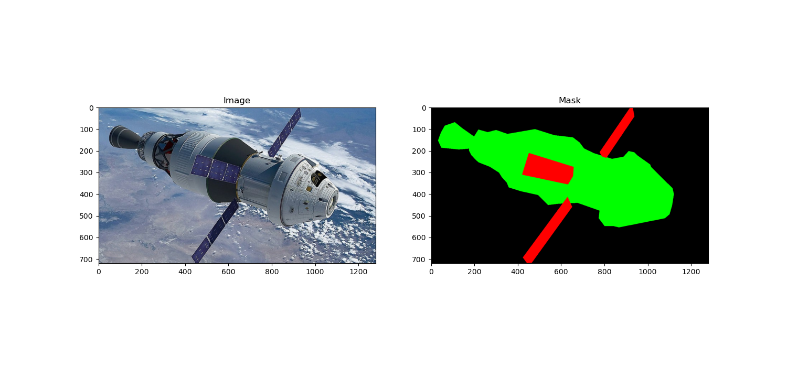

## Uncertainty Quantification in Satellite Image Segmentation
This repository contains experiments and implementations for uncertainty quantification in deep neural networks applied to image segmenetation tasks using a UNet CNN architecture. The goal is to leverage dropout layers and other uncertainity quantifications to measure prediction uncertainty. **There is a report in report/text/report.pdf that summerizew this project!**

- [Uncertainty Quantification in Satellite Image Segmentation](#uncertainty-quantification-in-satellite-image-segmentation)
- [Installation](#installation)
- [Usage](#usage)
  - [Primary Files:](#primary-files)
  - [Directory Structure:](#directory-structure)
  - [Running the experiments:](#running-the-experiments)
    - [Without docker](#without-docker)
    - [With docker](#with-docker)
- [Satellite Dataset](#satellite-dataset)
- [Information](#information)
  - [Improvements](#improvements)
- [Acknowledgements](#acknowledgements)
  - [Dataset:](#dataset)
  - [MC Dropout](#mc-dropout)
  - [Further UQ in Deep Learning](#further-uq-in-deep-learning)

## Installation

Clone the repository:

```bash
git clone https://github.com/mustachemo/Turion-Space-assessment.git
cd Turion-Space-assessment
```

Install the dependencies:

```bash
pip install -r requirements.txt
```

## Usage

### Primary Files:

- `main.py`: The main script to run the uncertainty experiments.
- `train.py`: The training script for the U-Net model.
- `predict.py`: The prediction script for the U-Net model.
- `configs.py`: Global configuration file for the experiments.

### Directory Structure:

- `model/`: The U-Net model implementation.
- `uncertainty_quantification/`: helper functions for Uncertainty Quantification experiments.
- `utils/`: utility functions for data loading, visualization, and custom loss functions.
- `report/`: report directory. Includes images, tex file, and pdf for report.
- `checkpoints/`: saved model checkpoints (empty/nonexistant until a model is trained).
- `data/`: the dataset directory (empty/nonexistant until you download the [dataset](https://github.com/Yurushia1998/SatelliteDataset) and put it in here).
- `logs/`: logs for training and validation metrics (empty/nonexistant until a model is trained).
- `prepped_data/`: preprocessed data for training and validation (empty/nonexistant until data from data/ directory is preprocessed).

### Running the experiments:

#### Without docker

1. Download the dataset from [here](https://github.com/Yurushia1998/SatelliteDataset)
2. Place the dataset (all files you download from the drive folder) in the `data/` directory.
3. Run `train.py` to train the model (The prepped data used for the training will be automatically generated and saved in the `prepped_data/` directory when running the training script).
4. Run `predict.py` to make predictions on the validation dataset.
5. Run `main.py` to run the experiments and generate the report.
   - Not all experiments are uncommented in the `main.py` file. You can uncomment further experiments you want to run.

```bash
python train.py
python predict.py
python main.py
```

#### With docker

1. Build the docker image:

```bash
sudo docker build -t satellite-unet .
```

2.1 Run the docker container:

```bash
sudo docker run --rm --shm-size=8g --ulimit memlock=-1 --gpus all -it -v $(pwd)/prepped_data:/data satellite-unet
```

- remove `--gpus all` if you don't have a GPU.

2.2 Run the docker container with docker-compose:
  
  ```bash
  sudo docker-compose up
  ```

## Satellite Dataset

The satellite dataset is primarly for object detection and segmentation using both synthetic and real satellite images. The dataset includes 3117 images (1280x720), bounding boxes, and masks (1280x720). Each satellite is segmented into at most 3 parts, including body, solar panel, and antenna, represented by three colors: green, red, and blue.



**Dataset Details**

- Images with index 0-1002 have fine masks, while images from index 1003-3116 have coarse masks.
- Training data includes 403 fine masks from index 0-402 and 2114 coarse masks from index 1003-3116, totaling 2517 images.
- The validation dataset includes 600 images with fine masks indexed from 403 to 1002.
- the file `all_bbox.txt` includes bounding boxes of all satellites inside the dataset based on segmentation masks. It's in the form of a dictionary with the index of images as the key. Each bounding box has the format [max_x, max_y, min_x, min_y].

## Information

- `model/bayesian_unet.py`: This attempt was to implement a Bayesian U-Net model using MC Dropout. I couldn't get the model to train because of memory constraints.

### Improvements

- [] Add function to augment data
- [] Optimize TensorFlow performance using the Profiler (https://www.tensorflow.org/guide/profiler#overview_page)
- [] Optimize TensorFlow GPU performance with the TensorFlow Profiler (https://www.tensorflow.org/guide/profiler)
- [] TensorFlow graph optimization with Grappler (https://www.tensorflow.org/guide/graph_optimization)
- [] Mixed precision (https://www.tensorflow.org/guide/mixed_precision)

## Acknowledgements

### Dataset:

- Link to the paper: [A Spacecraft Dataset for Detection, Segmentation and Parts Recognition](https://arxiv.org/abs/2106.08186)
- Link to the dataset: [https://github.com/Yurushia1998/SatelliteDataset](https://github.com/Yurushia1998/SatelliteDataset)

### MC Dropout

- [Yarin Gal](https://www.cs.ox.ac.uk/people/yarin.gal/website/blog_3d801aa532c1ce.html)

### Further UQ in Deep Learning

- [A review of uncertainty quantification in deep learning: Techniques, applications and challenges](https://www.sciencedirect.com/science/article/pii/S1566253521001081).
