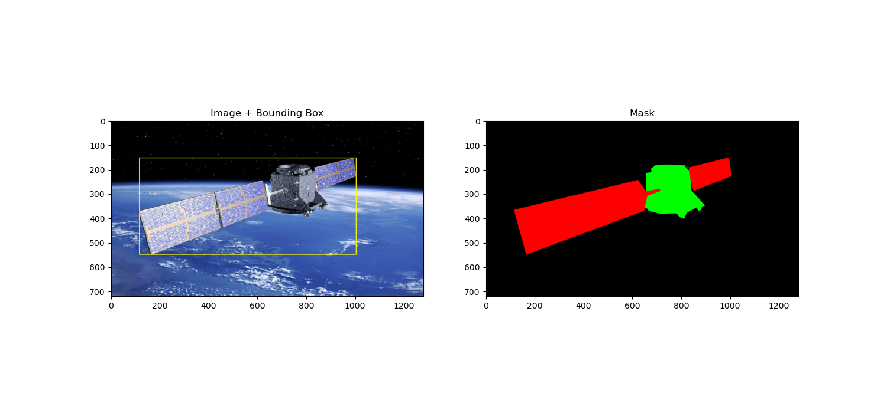

# Turion Space assessment

This repository contains experiments and implementations for uncertainty quantification in deep neural networks applied to object detection tasks. The goal is to leverage dropout layers and multiple stochastic forward passes to measure prediction uncertainty.

## Table of Contents

- [Turion Space assessment](#turion-space-assessment)
  - [Table of Contents](#table-of-contents)
  - [Introduction](#introduction)
  - [Installation](#installation)
  - [Usage](#usage)
  - [Dataset](#dataset)
  - [Acknowledgements](#acknowledgements)

## Introduction

Uncertainty quantification is crucial in critical applications like space object detection. This project aims to implement techniques to measure uncertainty in object detection models using dropout layers.

## Installation

Clone the repository:

```bash
git clone https://github.com/your-username/uncertainty-quantification-object-detection.git
cd uncertainty-quantification-object-detection
```

Install the dependencies:

```bash
pip install -r requirements.txt
```

## Usage

Run the experiments:

```bash
python experiments.py
```

## Dataset



A satellite dataset for object detection and segmentation using both synthesis and real satellite images.

Link to paper: [A Spacecraft Dataset for Detection, Segmentation and Parts Recognition](https://arxiv.org/abs/2106.08186)

Link to the dataset: https://github.com/Yurushia1998/SatelliteDataset

#A satellite dataset for object detection and segmentation using both synthesis and real satellite images.

#This dataset include 3116 images, mask with size 1280x720 and bounding boxes of both synthesis and real satellite images. Each satellite is segmented into at most 3 parts, including body, solar panel and antena by respectively 3 color: green,red,blue.

#Image with index 0-1002 has fine mask while images from index 1003-3116 has coarse masks.
The datasets is divided into 2 parts: train data including 403 fine mask from index 0-402 and 2114 coarse mask from index 1003-3116. The val dataset includes 600 images with fine mask indexed from 403 to 1002.

#File all_bbox.txt include bounding boxes of all satellites inside datasets based on segmentation masks in form of a dictionary with index of images as key. Each bounding boxes has format [max_x,max_y,min_x,min_y].

## Acknowledgements

This project is inspired by the work of [Yarin Gal](http://www.cs.ox.ac.uk/people/yarin.gal/website/index.html)
and [A review of uncertainty quantification in deep learning: Techniques, applications and challenges](https://www.sciencedirect.com/science/article/pii/S1566253521001081).

For the Turion Space assessment, I have implemented the following experiments:

- [x] Dropout layers in object detection models
- [ ] Monte Carlo dropout
- [ ] Ensemble methods
- [ ] Bayesian neural networks
- [ ] Calibration metrics
- [ ] Evaluation on SpaceNet dataset
- [ ] Report
